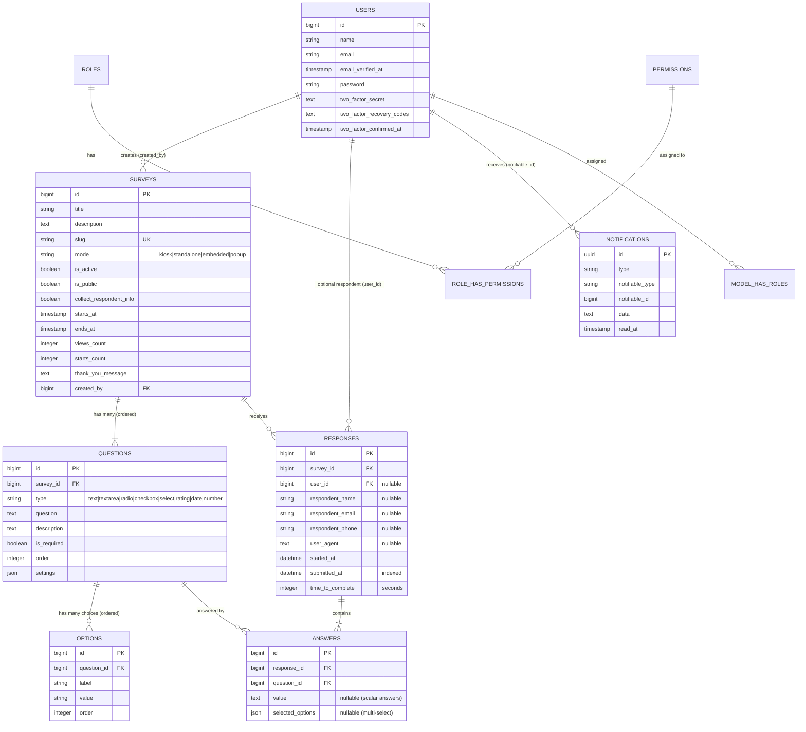

# Codebase Knowledge & Comprehensive Technical Audit

**Project:** Compliant Customer Satisfaction Survey System (Valenzuela)  
**Version:** 1.0  
**Stack:** Laravel 12 (PHP 8.2+) • Inertia.js v2 • React 19 • Tailwind CSS 4 • Filament 4.0  
**Date:** August 18, 2026  
**Document Purpose:** Single-source review document capturing overall architecture, stack, database structure, security, survey workflows, detractor alerts, export mechanisms, and testing status.

---

## 1. System Architecture & Tech Stack

### 1.1 Stack Matrix

| Layer | Technology | Version | Purpose & Evidence |
|---|---|---|---|
| **Backend Framework** | Laravel | `^12.0` | Core MVC framework, routing, queues, events (`composer.json`) |
| **PHP Runtime** | PHP | `^8.2` | Server runtime (`composer.json`) |
| **Frontend Framework** | React | `^19.2.0` | UI component library (`package.json`) |
| **SPA Bridge** | Inertia.js | `^2.2.17` / `^2.0` (PHP) | Monolithic SPA bridge without separate REST API (`package.json`, `composer.json`) |
| **Styling** | Tailwind CSS | `^4.1.17` | Utility-first CSS styling (`package.json`) |
| **Admin Panel** | Filament PHP | `^4.0` | Admin dashboard, CRUD resources, widgets (`composer.json`, `app/Filament/`) |
| **Authentication** | Laravel Fortify | `^1.30` | Headless authentication, 2FA (`config/fortify.php`, `app/Actions/Fortify/`) |
| **Authorization** | Spatie Permission + Shield | `^6.23` / `^4.0` | Role-based access control and Filament policies (`app/Policies/`, `database/seeders/RolesAndPermissionsSeeder.php`) |
| **Spreadsheet Exports** | Maatwebsite Excel + Spatie Simple Excel | `^3.1` / `^3.7` | Queued multi-sheet Excel & streaming exports (`app/Exports/`, `app/Services/ResponseExportService.php`) |
| **PDF Generation** | Barryvdh DomPDF + Snappy | `^3.1` / `^1.0` | Server-side PDF report compilation (`app/Jobs/GenerateSurveyPdfReport.php`) |
| **QR Code Engine** | BaconQrCode | `^3.0` | Survey sharing QR code generator (`app/Services/QrCodeService.php`) |
| **Testing Suite** | PestPHP + PHPUnit | `^3.8` / `^11.5` | Unit and feature test runner (`tests/Pest.php`, `phpunit.xml`) |
| **Linting & Formatting** | Pint + Prettier + ESLint | Latest | Code standard enforcement (`composer.json`, `eslint.config.js`, `.prettierrc`) |

### 1.2 High-Level Request Lifecycle

```text
                                  ┌──────────────────────────────────────────────┐
                                  │               Incoming Request               │
                                  └──────────────────────┬───────────────────────┘
                                                         │
                                   ┌─────────────────────┴─────────────────────┐
                                   │                                           │
                         [Public Survey Route]                       [Admin / Filament Route]
                                   │                                           │
                        routes/web.php (/surveys/*)                 routes/web.php & Filament Panel (/admin/*)
                                   │                                           │
                         SurveyController.php                               Filament Resources & Controllers
                                   │                                           │
              ┌────────────────────┴────────────────────┐                      │
              │                                         │                      ▼
       [GET /surveys/{slug}]                  [POST /surveys/{slug}]   ┌──────────────────────────────┐
              │                                         │              │ Authenticate & Verified Gate │
   Load Survey, Questions & Options          StoreSurveyResponseRequest│ ┌──────────────────────────┐ │
              │                                         │              │ │  ScopedByManager Filter  │ │
     Inertia::render('surveys/show')            Persist Response       │ └──────────────────────────┘ │
              │                                         │              └──────────────┬───────────────┘
          React SPA                              Persist Answers                      │
                                                        │                      ┌──────┴────────────────┐
                                                AnswerObserver Fires           │                       │
                                                        │              Filament Dashboard /    Queued Exports /
                                                Low Rating (<3)?       Resource Views          Reports (Excel/PDF)
                                                 ├── Yes ──> Filament Database Notification
                                                 └── No  ──> Complete Redirect to Thank You
```

---

## 2. Directory Structure & Key Entry Points

```
valenzuela-satisfaction-survey/
├── app/
│   ├── Actions/Fortify/               # Auth workflows (Password reset, user creation, 2FA)
│   ├── Enums/                         # Type-safe enums (SurveyMode)
│   ├── Exports/                       # Maatwebsite Excel export definitions (SurveyResponsesExport, etc.)
│   ├── Filament/Admin/
│   │   ├── Pages/                     # Custom admin pages (Dashboard, Custom Auth Login)
│   │   ├── Resources/                 # CRUD resources: Surveys, Questions, Responses, Users
│   │   └── Widgets/                   # Analytics widgets (RatingsChart, PremiumResponsesChart, Stats)
│   ├── Http/
│   │   ├── Controllers/               # SurveyController, SurveyExportController, ResponseExportController
│   │   ├── Middleware/                # Inertia sharing, authentication middleware
│   │   └── Requests/                  # StoreSurveyResponseRequest (dynamic validation)
│   ├── Jobs/                          # Background queue jobs (GenerateSurveyPdfReport)
│   ├── Logging/                       # Monolog processors (PiiScrubberProcessor)
│   ├── Models/                        # Survey, Question, Option, Response, Answer, User
│   │   └── Concerns/                  # ScopedByManager (multi-tenant manager isolation)
│   ├── Observers/                     # AnswerObserver (Detractor alerts)
│   ├── Policies/                      # SurveyPolicy, QuestionPolicy, ResponsePolicy, RolePolicy, UserPolicy
│   ├── Providers/                     # AppServiceProvider, AdminPanelProvider
│   └── Services/                      # QrCodeService, ResponseExportService
├── config/                            # Laravel configuration files (auth, fortify, permission, logging, etc.)
├── database/
│   ├── factories/                     # Model factories for testing and seeding
│   ├── migrations/                    # Schema migrations for all database tables
│   └── seeders/                       # Seeders for roles, permissions, surveys, and mock responses
├── resources/
│   ├── css/                           # Tailwind CSS & Filament theme styles
│   ├── js/
│   │   ├── components/                # Reusable React components
│   │   ├── layouts/                   # App & Survey layouts
│   │   ├── pages/                     # Inertia pages (surveys/index, surveys/show, surveys/thank-you, welcome)
│   │   └── types/                     # TypeScript definitions
│   └── views/                         # Blade templates (exports/survey-responses.blade.php for PDF)
├── routes/
│   ├── web.php                        # Public survey routes, export endpoints, asset server
│   ├── settings.php                   # User profile settings routes
│   └── console.php                    # Artisan console commands
└── tests/
    ├── Feature/                       # Controller, scoping, export, and observer feature tests
    └── Unit/                          # Model and helper unit tests
```

---

## 3. Database Structure & Schemas

### 3.1 Entity Relationship Diagram (ERD)



### 3.2 Key Database Details & Indices

- **Cascade Deletions**: Deleting a `Survey` cascades to all associated `Questions` and `Responses`. Deleting a `Question` cascades to its `Options` and `Answers`. Deleting a `Response` cascades to its `Answers`.
- **Indexing**: `responses.submitted_at` has an explicit database index (`2026_05_25_193449_add_index_to_submitted_at_on_responses_table.php`) for fast aggregation across time-series queries and dashboard widgets.
- **Computed Attributes**:
  - `Survey::getCompletionRateAttribute()`: Cached for 5 minutes (`300s`), calculated as `(completed_responses / starts_count) * 100`.
  - `Survey::getAverageCompletionTimeAttribute()`: Cached for 5 minutes (`300s`), calculated as `avg(time_to_complete)`.

---

## 4. Authentication & Authorization

### 4.1 Authentication System
- **Provider**: **Laravel Fortify** (`config/fortify.php`) configured for headless authentication.
- **Admin Authentication**: Routed to Filament's login page (`/admin/login`) powered by `App\Filament\Admin\Pages\Auth\Login`.
- **Panel Access Control**: `User` model implements `FilamentUser` with `canAccessPanel(Panel $panel)`. Access requires a verified email (`$this->hasVerifiedEmail()`).
- **Two-Factor Authentication (2FA)**: Full support via Fortify's `TwoFactorAuthenticatable` trait with recovery codes and QR code setup.

### 4.2 Role-Based Access Control (RBAC)
Role hierarchy and permissions managed via **Spatie Laravel Permission** and **Filament Shield**:

1. **`super_admin`**:
   - Granted full access through `Gate::before` callback in `AppServiceProvider`.
   - Cannot delete, update, or replicate the protected `super_admin` role itself.
2. **`admin`**:
   - Full CRUD over `Users`, `Surveys`, `Questions`, `Responses`, `Roles`, and `Permissions`.
   - Access to system-wide exports and analytics.
3. **`manager`**:
   - Focused role for survey creation and response analysis.
   - Has permissions to manage surveys, questions, and view/export responses.
   - **Tenancy-Scoped**: Constrained strictly to their own data via `ScopedByManager`.

### 4.3 Multi-Tenancy Scoping (`ScopedByManager`)
- Located in `App\Models\Concerns\ScopedByManager.php`.
- Applied to: `Survey`, `Question`, `Response`, `Answer`.
- Behavior: When an authenticated user with the `manager` role (and without `admin`/`super_admin`) visits an `admin*` route, an Eloquent global scope automatically applies:
  - `Survey`: `where('created_by', auth()->id())`
  - `Question`: `whereHas('survey', fn($q) => $q->where('created_by', auth()->id()))`
  - `Response`: `whereHas('survey', fn($q) => $q->where('created_by', auth()->id()))`
  - `Answer`: `whereHas('response.survey', fn($q) => $q->where('created_by', auth()->id()))`

---

## 5. Survey Submission Flow

```text
 1. Guest visits /surveys/{slug}
    │
    ▼
 2. SurveyController@show
    ├── Verifies $survey->isOpen() (checks is_active, starts_at, ends_at)
    ├── $survey->incrementViews() (updates views_count)
    ├── If first visit in session -> $survey->incrementStarts() & sets session 'survey_started_{id}'
    └── Loads questions ordered with options -> Renders Inertia 'surveys/show'
    │
    ▼
 3. User fills out React form and submits POST to /surveys/{slug}
    │
    ▼
 4. StoreSurveyResponseRequest Validation
    ├── Validates respondent_name, respondent_email, started_at
    └── Iterates through survey questions dynamically applying type rules:
        ├── TEXT / TEXTAREA: max 1000 / 5000 chars
        ├── RATING: integer between 1 and 5
        ├── CHECKBOX: array of selections
        └── RADIO / SELECT: string value
    │
    ▼
 5. SurveyController@store Execution
    ├── Calculates completion duration: abs(now()->diffInSeconds(started_at))
    ├── Creates Response record in database
    ├── Creates Answer records for each question
    │     ├── Array answers -> saved in 'selected_options' column (JSON)
    │     └── Scalar answers -> saved in 'value' column (TEXT)
    │
    ▼
 6. AnswerObserver Triggers
    └── Checks if rating question < 3 (Detractor) -> Dispatches low rating notification
    │
    ▼
 7. Response Redirect
    └── Redirects to /surveys/{slug}/thank-you with flash message
```

---

## 6. Detractor Alert Implementation

### 6.1 Detractor Workflow
The detractor alerting system captures customer dissatisfaction in real time:

- **Hook**: Handled by `App\Observers\AnswerObserver::created(Answer $answer)`.
- **Registration**: Registered globally in `AppServiceProvider::boot()` (`Answer::observe(AnswerObserver::class)`).
- **Condition**:
  1. Skips during database seeding (`config('app.seeding') === true`).
  2. Identifies questions where `$question->type === Question::TYPE_RATING`.
  3. Evaluates if `$ratingValue > 0 && $ratingValue < 3` (Scores `1` or `2` out of 5).
- **Target Recipient**: Dispatched to the survey creator (`$survey->creator`).

### 6.2 Notification Structure
- Delivered via Filament's database notification driver to the `notifications` table.
- Notification Payload:
  - **Title**: `Low Rating Alert`
  - **Status**: `warning`
  - **Body**: `Survey '{title}' received a low rating ({rating}/5) from {respondent_name|Anonymous}.`
  - **Action Button**: Direct link to the Filament response viewer (`filament.admin.resources.responses.view`).

---

## 7. Export Implementation

The application supports three export pipelines:

### 7.1 Single Survey Excel Export (Queued)
- **Route**: `GET /admin/surveys/{survey}/export/excel` (`SurveyExportController@exportExcel`).
- **Engine**: `App\Exports\SurveyResponsesExport` via `Maatwebsite\Excel\Facades\Excel::queue()`.
- **Queueing & Storage**: Generates file asynchronously on the `private` storage disk.
- **Styling & Layout**:
  - Blue header bar (`#1E40AF`) with white bold text.
  - Frozen header pane at `A2`.
  - Merged title and metadata banner displaying export timestamp and total count.
  - Alternating light-gray zebra rows (`#F3F4F6`).
  - Auto-sized columns.
- **Completion Notification**: On completion, sends a database notification to the requesting user with a secure download URL.

### 7.2 Multi-Response / Filtered Excel & CSV Export (Streaming)
- **Controller**: `App\Http\Controllers\ResponseExportController`.
- **Service**: `App\Services\ResponseExportService`.
- **Engine**: `Spatie\SimpleExcel\SimpleExcelWriter::streamDownload()`.
- **Capabilities**: Dynamically transforms dynamic question answers into tabular columns with standardized headers without loading entire datasets into server memory.

### 7.3 Survey PDF Analytics Report (Queued & Streamed)
- **Queued Job**: `App\Jobs\GenerateSurveyPdfReport` dispatched via `GET /admin/surveys/{survey}/export/pdf`.
- **Engine**: `Barryvdh\DomPDF\Facade\Pdf`.
- **Data Compilation**:
  - Calculates per-question response counts.
  - Calculates average score and rating distributions for `rating` questions.
  - Calculates option frequency distributions for `radio`, `select`, and `checkbox` questions.
  - Extracts sample text answers for open-ended questions.
- **Template**: Rendered via Blade view `resources/views/exports/survey-responses.blade.php`.
- **Delivery**: Written to `private` disk; notification sent to user with download action.
- **Secure Download Route**: `GET /admin/exports/download?path={filename}` validates file presence on `private` disk and streams file with proper MIME headers.

---

## 8. Security & Privacy Implementation

1. **PII Log Redaction (`PiiScrubberProcessor`)**:
   - Monolog processor implemented in `App\Logging\PiiScrubberProcessor.php`.
   - Intercepts all Monolog log records and recursively redacts sensitive fields up to 10 levels deep.
   - Redacted fields include: `answers`, `email`, `email_address`, `name`, `first_name`, `last_name`, `ip`, `ip_address`, `phone`, `phone_number`, `address`, `password`, `token`, `two_factor_secret`, `two_factor_recovery_codes`.
2. **Private Storage Isolation**:
   - All exported Excel spreadsheets and PDF reports are stored on the non-public `private` disk (`storage/app/private`).
   - Direct file access via web server is prevented; files can only be accessed through authenticated and authorized controller endpoints (`downloadExport`).
3. **Sandboxed Static Asset Server**:
   - Endpoint `/js/{path}` safely serves embedded widgets to sandboxed iframes.
   - Includes path traversal protection (`realpath()` and prefix checking against `resources/js-static/`).
   - Applies explicit CORS headers (`Access-Control-Allow-Origin: *`) for sandboxed null-origin iframes.
4. **Data Privacy & Anonymity**:
   - Public surveys allow anonymous submissions (`collect_respondent_info` configurable per survey).
   - Respondent user agents and timestamps are captured for auditability while preserving optional identity.

---

## 9. Testing Status & Test Suite Audit

### 9.1 Test Execution Summary (`php artisan test`)
- **Total Tests**: 146
- **Passing**: 137
- **Failing**: 6
- **Skipped**: 2
- **Todo**: 1
- **Duration**: ~20.2s

```
Tests:    6 failed, 1 todo, 2 skipped, 137 passed (5856 assertions)
```

### 9.2 Test Breakdown by Feature Area

| Test Suite | Passing | Failing | Purpose | Notes |
|---|---|---|---|---|
| **AnswerObserverTest** | 2 | 0 | Verifies detractor alert dispatch and seeding skip | 100% Pass |
| **Auth & Settings** | 18 | 0 | Authentication, password reset, 2FA, profile updates | 100% Pass |
| **Dashboard & Widgets** | 12 | 0 | Filament widgets, stats, ratings calculation integrity | 100% Pass |
| **Exports & Jobs** | 15 | 0 | Excel/PDF export jobs, formatting, download security | 100% Pass |
| **Public Survey Controller** | 22 | 0 | Public listing, validation, start/view tracking, submit | 100% Pass |
| **Filament Admin Resources** | 35 | 1 | Filament CRUD, Question/Response forms, Role Policy | 1 failure in `RolePolicyTest` |
| **Manager Scoping** | 3 | 5 | Multi-tenant scoping for Managers | 5 failures in `SurveyScopingTest` |
| **Unit Models** | 30 | 0 | Survey duration, completion rates, answer relationships | 100% Pass |

### 9.3 Root Cause Analysis of the 6 Test Failures

#### 1. `RolePolicyTest > super admin role cannot be updated, deleted, or replicated`
- **Error**: `Failed asserting that true is false` at `tests/Feature/Filament/RolePolicyTest.php:21`.
- **Cause**: `AppServiceProvider::boot()` contains a `Gate::before` callback that intercepts authorization checks. When checking `$superAdminUser->can('update', $superAdminRole)`, the Gate condition check allows `super_admin` user to pass before `RolePolicy` evaluates the denial.

#### 2. `SurveyScopingTest` (5 Failures: Survey, Response, Question, Option, Answer scoping)
- **Error**: `Failed asserting that actual size 2 matches expected size 1` at `tests/Feature/SurveyScopingTest.php:36, 93, 129, 151, 176`.
- **Cause**: `ScopedByManager` uses `request()->is('admin*')` inside its global scope builder. In direct model tests where queries like `Survey::all()` or `Response::all()` are executed without dispatching an HTTP request to an `/admin/*` URL, `request()->is('admin*')` evaluates to `false`, causing the global scope to be bypassed in raw unit/model calls.

---

## 10. Conventions, Concerns & Technical Debt

### 10.1 Code Conventions
- **Naming**: Classes/Components in `PascalCase`, methods/variables in `camelCase`, database tables/columns in `snake_case`, environment variables in `SCREAMING_SNAKE_CASE`.
- **Formatting**: PHP formatted via **Laravel Pint** (`PSR-12`); TypeScript/React formatted via **Prettier** with `prettier-plugin-organize-imports`.
- **Max Line Length**: 120 characters across all codebase and documentation files.
- **Frontend Paths**: `@/*` alias mapped to `resources/js/*`.

### 10.2 Known Concerns & Recommendations
1. **Manager Scoping in CLI / Background Contexts**:
   - Because `ScopedByManager` checks `request()->is('admin*')`, manager scoping is strictly tied to HTTP web requests. Any background jobs, exports, or artisan commands operating on behalf of a manager require manual scoping.
2. **Frontend Test Coverage**:
   - The PHP/Laravel backend has extensive test coverage (146 tests), but the React frontend currently lacks component-level unit tests (Vitest / React Testing Library).
3. **Queue Driver in Production**:
   - PDF reports and large Excel exports use Laravel Queues (`GenerateSurveyPdfReport`, `SurveyResponsesExport`). In production, ensure a persistent queue worker (Redis + Laravel Horizon) is configured rather than the `sync` driver.

---

## 11. Evidence & Verified File Index

| File / Component | Verified Absolute Path |
|---|---|
| **Survey Model** | [`app/Models/Survey.php`](file:///c:/Users/admin/Herd/valenzuela-satisfaction-survey/app/Models/Survey.php) |
| **Question Model** | [`app/Models/Question.php`](file:///c:/Users/admin/Herd/valenzuela-satisfaction-survey/app/Models/Question.php) |
| **Response Model** | [`app/Models/Response.php`](file:///c:/Users/admin/Herd/valenzuela-satisfaction-survey/app/Models/Response.php) |
| **Answer Model** | [`app/Models/Answer.php`](file:///c:/Users/admin/Herd/valenzuela-satisfaction-survey/app/Models/Answer.php) |
| **User Model** | [`app/Models/User.php`](file:///c:/Users/admin/Herd/valenzuela-satisfaction-survey/app/Models/User.php) |
| **ScopedByManager Trait** | [`app/Models/Concerns/ScopedByManager.php`](file:///c:/Users/admin/Herd/valenzuela-satisfaction-survey/app/Models/Concerns/ScopedByManager.php) |
| **Survey Controller** | [`app/Http/Controllers/SurveyController.php`](file:///c:/Users/admin/Herd/valenzuela-satisfaction-survey/app/Http/Controllers/SurveyController.php) |
| **Store Response Request** | [`app/Http/Requests/StoreSurveyResponseRequest.php`](file:///c:/Users/admin/Herd/valenzuela-satisfaction-survey/app/Http/Requests/StoreSurveyResponseRequest.php) |
| **Detractor Observer** | [`app/Observers/AnswerObserver.php`](file:///c:/Users/admin/Herd/valenzuela-satisfaction-survey/app/Observers/AnswerObserver.php) |
| **Excel Export Class** | [`app/Exports/SurveyResponsesExport.php`](file:///c:/Users/admin/Herd/valenzuela-satisfaction-survey/app/Exports/SurveyResponsesExport.php) |
| **Export Service** | [`app/Services/ResponseExportService.php`](file:///c:/Users/admin/Herd/valenzuela-satisfaction-survey/app/Services/ResponseExportService.php) |
| **PDF Generation Job** | [`app/Jobs/GenerateSurveyPdfReport.php`](file:///c:/Users/admin/Herd/valenzuela-satisfaction-survey/app/Jobs/GenerateSurveyPdfReport.php) |
| **PII Scrubber** | [`app/Logging/PiiScrubberProcessor.php`](file:///c:/Users/admin/Herd/valenzuela-satisfaction-survey/app/Logging/PiiScrubberProcessor.php) |
| **Web Routes** | [`routes/web.php`](file:///c:/Users/admin/Herd/valenzuela-satisfaction-survey/routes/web.php) |
| **Admin Panel Provider** | [`app/Providers/Filament/AdminPanelProvider.php`](file:///c:/Users/admin/Herd/valenzuela-satisfaction-survey/app/Providers/Filament/AdminPanelProvider.php) |
| **App Service Provider** | [`app/Providers/AppServiceProvider.php`](file:///c:/Users/admin/Herd/valenzuela-satisfaction-survey/app/Providers/AppServiceProvider.php) |
| **Roles & Permissions Seeder** | [`database/seeders/RolesAndPermissionsSeeder.php`](file:///c:/Users/admin/Herd/valenzuela-satisfaction-survey/database/seeders/RolesAndPermissionsSeeder.php) |
